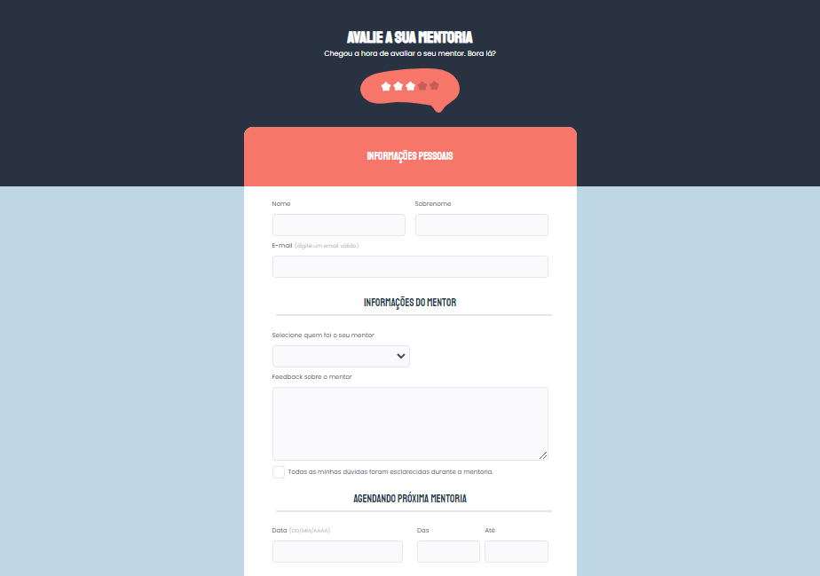

# Elaboração de Formulário 
## Explorer Rocketseat -> Stage 03 = Nível avançado.

### *Análise de projeto*

Layout de projeto disponível [aqui](https://www.figma.com/file/FRT7y2CGifAfUaN4Z2TA2L/Stage-03---Formul%C3%A1rio-avan%C3%A7ado-(Copy)?node-id=0%3A1)

Utilização de Tags Semânticas - Atenção a acessibilidade - Utilização de tag select - Checkbox customizado - Utilização de ::before, :hover e :nth-child - Posicionamentos com displey flex -  Utilização de bloqueio de seleção com data-default disabled selected 
Utilização de onfocus="(this.type=&quot;date&quot;)" e placeholder="" em campo de seleção de data e hora.
Validação de preenchimento com required.

#### HTML
* Header
* Main 
* Footer

#### CSS

* Fontes 
Staatliches - Títulos
Poppins  - Corpo ou conteúdo no geral

* Cores
Background
    body - #BFD7E4
    header - #293241
    form - #FFFFFF
    inputs - #FAFAFC
    button e first legend - #F67669  

* Textos
    header e button - #FFFFFF
    Legends - #253B51
    geral - #4E4958
    span - #C1BCCC

### JS - Interações a desenvolver!

